# Eclat & dEclat

Project for the Data Mining Methods course at Warsaw University of Technology, during the fall semester of 2022.

**Grade:** 10/10

The scope of work was divided among the authors as follows:
- [Stage 0 (29.11.2022)](#stage-0-29112022) - Adam Steciuk, Piotr Chojnowski
- [Stage 1 (13.12.2022)](#stage-1-13122022) - Adam Steciuk
- [Stage 2](#stage-2) - Piotr Chojnowski

This repository contains the results of the 0th and 1st stages of the project.

## Table of contents
- [Eclat \& dEclat](#eclat--declat)
  - [Table of contents](#table-of-contents)
  - [Stage 0 (29.11.2022)](#stage-0-29112022)
    - [Problem description](#problem-description)
    - [Determination of the Dataset](#determination-of-the-dataset)
      - [Preprocessing Steps](#preprocessing-steps)
      - [Implementation Concept](#implementation-concept)
  - [Stage 1 (13.12.2022)](#stage-1-13122022)
    - [Technical Specification](#technical-specification)
    - [Project repository](#project-repository)
    - [Data Retrieval and Preparation](#data-retrieval-and-preparation)
      - [Unit Tests](#unit-tests)
    - [Eclat and dEclat](#eclat-and-declat)
      - [Unit Tests](#unit-tests-1)
    - [Visualization of Results](#visualization-of-results)
      - [Technological Assumptions](#technological-assumptions)
      - [Functionality](#functionality)
    - [Experiments](#experiments)
      - [Definition of Research Data](#definition-of-research-data)
      - [Plan of Experiments](#plan-of-experiments)
      - [Conducting the Experiments](#conducting-the-experiments)
      - [Visualization and Analysis of Results](#visualization-and-analysis-of-results)
      - [Experiment Summary and Possible Improvements](#experiment-summary-and-possible-improvements)

## Stage 0 (29.11.2022)
### Problem description
dEclat is an algorithm used for discovering frequent itemsets.

Algorithm pseudocode:

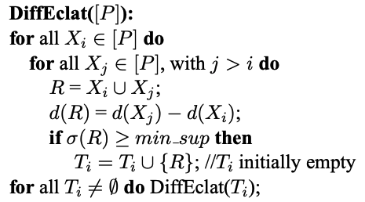

The input data for the algorithm is a set of all classes P. Frequent itemsets are generated by processing subsets of all unique pairs from the input set. The subsets of each pair are combined, and then a differential list is determined. If a given list is frequent (i.e., it meets the support threshold specified by the user), it is added to the frequent set at that level. The process is repeated until all frequent itemsets for the given input classes are generated.

For memory management, it is required to keep differential lists in memory for at most two consecutive levels. (We can remove differential lists for a given level once all frequent itemsets for the next level have been determined).

Consider the following example:

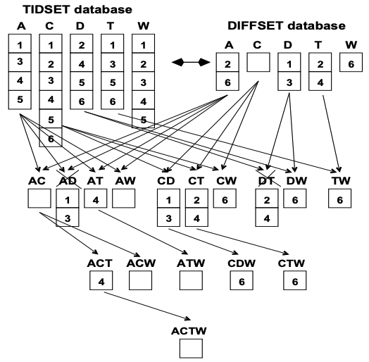

Analyzing the example above, set $A$ contains all elements that do not occur in the combined set of all elements ($(\{1,2,3,4,5,6\} \setminus \{1,3,4,5\} = \{2,6\})$). Set $AD$ contains all elements occurring in $D$ that do not occur in $A$. In the attached example, `min_sup` has been set at $50%$, so set $AD$ is not frequent ($|d(A)| - |d(AD)| < 3$, where $4-2=2$).

### Determination of the Dataset
The input dataset will consist of titles from English posts on Reddit. With this dataset in mind, the algorithm can be utilized to identify sets of frequently used words specific to a particular subreddit. If a subreddit lacks distinctive vocabulary, the algorithm will likely yield the most commonly used English words, often found on stop lists. A minor adjustment to the token creation algorithm, such as filtering out stop words, could significantly alter the program's outcomes. With the right dataset, such modifications could transform dEclat into a useful heuristic for NLP tasks like Named Entity Recognition (NER).

#### Preprocessing Steps
The retrieved posts will undergo the following preprocessing steps:
- Removal of all punctuation marks and digits from the input texts.
- Conversion of all uppercase letters to lowercase.
- Tokenization - dividing the text into meaningful "tokens" (typically words).
- Stemming - converting words in the input texts to their base morphological variants (e.g., `likes`, `liked`, `likely`, `liking` will be converted to `like`).
- Filtering out word repetitions for each post.
- Conversion of each word into a unique identifier.

For the example input data:

Original Texts:
- `"You like him, don't you?"`
- `"Likely, I will be getting 2 more for you."`

Preprocessed Texts:
- `"You like him dont you"`
- `"Likely I will be getting more for you"`

Tokenized Texts:
- `["you", "like", "him", "dont", "you"]`
- `["likely", "i", "will", "be", "getting", "more", "for", "you"]`

Stemmed Texts:
- `["you", "like", "him", "dont", "you"]`
- `["like", "i", "will", "be", "get", "more", "for", "you"]`

Filtered Texts:
- `["you", "like", "him", "dont"]`
- `["like", "i", "will", "be", "get", "more", "for", "you"]`

Texts Converted to Unique Identifiers:
- `[1, 2, 3, 4]`
- `[2, 5, 6, 7, 8, 9, 10, 1]`

#### Implementation Concept
The data will be retrieved using a console program created in Python. The program will accept the following arguments:
- The name of the subreddit from which titles will be retrieved.
- The type of posts to retrieve (new, popular, controversial, etc.).
- The time period from which titles will be retrieved (last day, week, month, etc.).
- The directory in which retrieved posts will be saved.
- The number of posts to retrieve.

The posts will be fetched from the Reddit API using the [praw](https://praw.readthedocs.io/en/latest/getting_started/quick_start.html) library, tokenized, and stemmed using the [nltk](https://pypi.org/project/nltk/) library. The remaining processing will be done using the [pandas](https://pandas.pydata.org/) library. The final results will be saved in JSON format in the directory specified upon program execution.

## Stage 1 (13.12.2022)
### Technical Specification
- The project will be developed using [Visual Studio Code](https://code.visualstudio.com/).
- [Git](https://git-scm.com/) version control system and [GitHub](https://github.com/) service will be utilized.
- Python 3 will be the primary programming language for the project.
- Unit tests will be implemented using the [pytest](https://docs.pytest.org/en/7.2.x/) framework.
- The [black](https://github.com/psf/black) autoformatter will ensure consistent source code style following PEP8 requirements.
- Type correctness will be maintained using the [mypy](http://mypy-lang.org/) library.
- The [isort](https://pycqa.github.io/isort/) library will be employed for automatic sorting of imported module declarations.

### Project repository
The repository containing results of [stage 1](#stage-1-13122022) of the project can be found at: [https://github.com/steciuk/MED-dEclat-1](https://github.com/steciuk/MED-dEclat-1).

### Data Retrieval and Preparation
A script called [get_reddit.py](get_reddit.py) has been created, which, following the concept presented in section [Determination of the Dataset](#determination-of-the-dataset), determines the dataset by fetching titles from the specified subreddit.

To ensure the script functions correctly, you need to create a file named `reddit_secrets.py` in the project root directory and place your Reddit API keys in it. These keys can be generated by following the [instruction](https://docs.aws.amazon.com/solutions/latest/discovering-hot-topics-using-machine-learning/retrieve-and-manage-api-credentials-for-reddit-api-authentication.html).

The `reddit_secrets.py` file should contain the following lines:

```
CLIENT_ID = "xxxxxxxxxxxxxxxx"
CLIENT_SECRET = "xxxxxxxxxxxxxxxxxxxxxxxxxxxxx"
```

The tool's console interface is built using the [click](https://click.palletsprojects.com/) library.

Help message, describing the tool's usage:

```
Options:
  -s, --subreddit TEXT            Subreddit to scrape  [required]
  -n, --num_posts INTEGER RANGE   Number of posts to scrape  [default: 100; x>=1]
  -l, --listing [hot|new|top|controversial]
                                  Listing to use  [default: top]
  -t, --time_filter [day|week|month|year|all]
                                  Time filter. Used only for top and
                                  controversial  [default: all]
  -d, --directory PATH            Directory to save the data  [default: data]
  --help                          Show this message and exit.
```

If the program is invoked with invalid arguments, it will terminate and display an appropriate error message.

The program generates three files and saves them to the following location:

```
./<directory>/<subreddit>_<num_posts>_<listing>_<time_filter>_<current_datetime>
```
Where:
- `<current_datetime>` is a timestamp representing the script's start time in the format `YYYYMMDD_HHMMSS`.
- The remaining placeholders correspond to the script's input parameters.

The generated files are:

- `metadata.json`: Contains information about the program's input parameters.
- `data.json`: Contains the extracted post titles and their corresponding token IDs.
- `tokens_map.json`: Maps token IDs to tokens.

For the invocation:

```bash
get_reddit -s machinelearning -n 5 -l top -t year
```

The following files are generated in the specified format:

- `metadata.json`:
  
```json
{
  "subreddit": "machinelearning",
  "listing": "top",
  "time_filter": "year",
  "num_posts": 5
}
```

- `data.json

```json
{
  "title":{
    "0":"I made a robot that punishes me if it detects that if I am procrastinating on my assignments [P]",
    "1":"[R] Speech-to-speech translation for a real-world unwritten language",
    "2":"[P] I made an AI twitter bot that draws people\u2019s dream jobs for them.",
    "3":"[D] Types of Machine Learning Papers",
    "4":"[P] WebtoonMe Project: Selfie to Webtoon style"
  },
  "tokens":{
    "0":[0, 1, 2, 3, 4, 5, 6, 7, 8, 9, 10, 11, 12, 13, 14, 15],
    "1":[16, 17, 18, 19, 2, 20, 21, 22],
    "2":[15, 0, 1, 23, 24, 25, 26, 4, 27, 28, 29, 30, 19, 31],
    "3":[32, 33, 34, 35, 36, 37],
    "4":[15, 38, 39, 40, 41, 42, 43]
  }
}
```

- `tokens_map.json`:

```json
{
  "token":{
    "0":"i",
    "1":"made",
    "2":"a",
    "3":"robot",
    "4":"that",
    "5":"punish",
    "6":"me",
    "7":"if",
    "8":"it",
    "9":"detect",
    "10":"am",
    "11":"procrastin",
    "12":"on",
    ... 
    "43":"style"
  }
}
```

#### Unit Tests
The `test_get_reddit.py` file contains unit tests that verify the correct functionality of critical parts of the script.

```
...
PASSED test/test_get_reddit.py::test_remove_non_alpha
PASSED test/test_get_reddit.py::test_remove_duplicates_in_rows
PASSED test/test_get_reddit.py::test_create_token_ids
...
```

### Eclat and dEclat
The `build_tree.py` script is a console application that implements the Eclat and dEclat algorithms for frequent itemset mining. It utilizes the click library for its command-line interface.

Help message, describing the tool's usage:

```
Options:
  -d, --directory PATH            Directory to load the data from  [required]
  -s, --support INTEGER RANGE     Minimum support for frequent itemsets [x>=1; required]
  -a, --algorithm [declat|eclat]  Algorithm to run  [default: declat]
  --help  
```

The script requires the following arguments:
- the path to the directory containing the `data.json` and `tokens_map.json` files generated by the script described in the previous section,
- the minimum support threshold for frequent itemsets,
- the algorithm to run (`eclat` or `declat`). The default algorithm is `declat`.

Providing incorrect program arguments will result in the termination of the program and the display of an appropriate message.

The program validates the format (and partially the content) of the retrieved files. If any issues are encountered, an appropriate message is displayed.

The output of the algorithm is a single JSON file (`declat.json` for the Declat algorithm or `eclat.json` for the dEclat algorithm). The file is automatically saved in the same directory from which the input files were retrieved.

The output file contains information about the minimum support selected by the user and a tree structure of objects (nodes) with properties defined by the class:

```python
class TreeNode:
    tokens_ids: list[int]
    tokens: list[str]
    support: int
    id_set: set[int]
    children: list[TreeNode]
```

Where:

- `tokens_ids` - a list of token identifiers that make up the itemset.
- `tokens` - a list of decoded tokens.
- `support` - the support value of the itemset.
- `id_set` - in the case of Eclat, this is the tidlist containing the identifiers of the transactions where the itemset is found. In the case of dEclat, it is the difflist containing the identifiers of transactions where the itemset is not found relative to the parent.
- `children` - the children of the given node.

For the invocation:

```bash
build_tree -d data/test_500_top_year_20221209_201531 -s 4 -a declat
```

The `declat.json` with the following structure is generated:

```json
{
  "min_support": 4,
  "tree": {
    "tokens_ids": [],
    "tokens": [],
    "support": 500,
    "id_set": [],
    "children": [
      {
        "tokens_ids": [3],
        "tokens": ["test"],
        "support": 206,
        "id_set": [0, 1, 3, 4 ... 496, 497, 498, 499],
        "children": [
          {
            "tokens_ids": [3, 4],
            "tokens": ["test", "if"],
            "support": 11,
            "id_set": [6, 10, 16, 17 ... 487, 488, 489, 491, 495],
            "children": [
              {
                "tokens_ids": [3, 4, 9],
                "tokens": ["test", "if", "post"],
                "support": 5,
                "id_set": [483, 232, 209, 20, 87, 479],
                "children": []
              },
              {
                "tokens_ids": [3, 4, 78],
                "tokens": ["test", "if", "see"],
                "support": 5,
                "id_set": [2, 483, 294, 424, 209, 216],
                "children": []
              },
              ...
            ]
          },
          ...
        ]
      },
      ...
    ]
  }
}
``` 

For the invocation with the Eclat algorithm, a similar file is generated.

#### Unit Tests
The `test_build_tree.py` file contains unit tests that verify the correct functionality of critical parts of the script.

```
PASSED test/test_build_tree.py::test_load_data_missing_files
PASSED test/test_build_tree.py::test_load_data
PASSED test/test_build_tree.py::test_get_id_sets_map
PASSED test/test_build_tree.py::test_TreeNode
PASSED test/test_build_tree.py::test_build_declat_root
PASSED test/test_build_tree.py::test_build_declat_tree
PASSED test/test_build_tree.py::test_get_tid_sets_map
PASSED test/test_build_tree.py::test_build_eclat_root
PASSED test/test_build_tree.py::test_build_eclat_tree
```

### Visualization of Results
Due to the difficulty in finding a suitable tool to visualize the structure of the resulting trees, I decided to create my own web application for this purpose.

#### Technological Assumptions
- The application was built using the [React](https://pl.reactjs.org) library.
- [TypeScript](https://www.typescriptlang.org) was the programming language used in the project.
- [React D3 Tree](https://github.com/bkrem/react-d3-tree) library was utilized for rendering tree structures.
- [AG Grid](https://www.ag-grid.com/) library was used for displaying tabular structures.
- The application was deployed using the [Firebase](https://firebase.google.com/) hosting service.
- [ESlint](https://eslint.org) linter was configured in the project to ensure syntactic consistency and help identify errors in the source code in advance.
- Automatic source code formatting settings were configured in the project using the [Prettier](https://prettier.io) extension. This solution helped maintain consistency in the coding style throughout the project.

#### Functionality
- The application has been deployed and is accessible at [https://declat.steciuk.dev/](https://declat.steciuk.dev/).
- The source code is located in the [Stage 1 project repository](https://github.com/steciuk/MED-dEclat-1), in the [/tools/visualizer subdirectory](/tools/visualizer/).

UI of the application after loading the page:

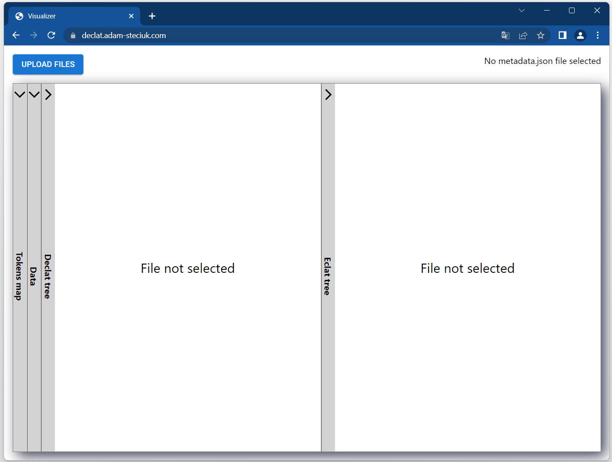

Upon pressing the `UPLOAD FILES` button, the application allows uploading files that are results of the programs described in [Data Retrieval and Preparation](#data-retrieval-and-preparation) and [Eclat and dEclat](#eclat-and-declat).

Upon uploading, independent validation of the contents of each file is performed. An error in one file does not interrupt the processing of the others. Detection of an error results in displaying an appropriate message on the screen.

Example of an error message displayed when the data format is incorrect:

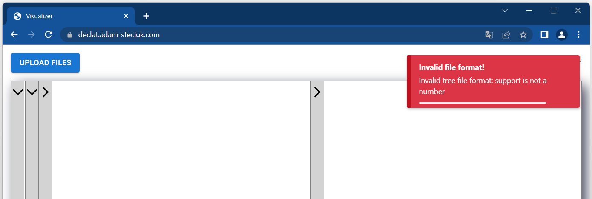

After uploading the `metadata.json` file, in the top right corner of the screen, information about the origin and size of the data is displayed, along with a button that directly navigates the user to the subreddit page from which the data was retrieved.

After uploading the `declat.json` and `eclat.json` files the respective resulting trees are displayed in the "Declat tree" and "Eclat tree" panels. The view in these panels can be freely scrolled, zoomed in, and zoomed out.

Example of a tree structure and the metadata displayed in the application:

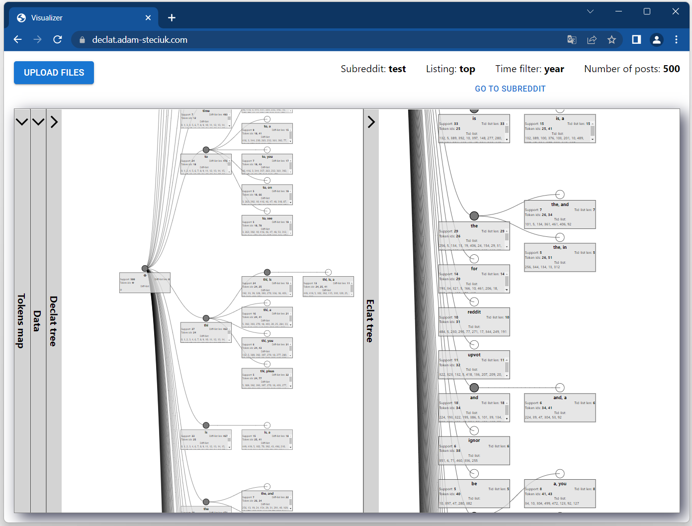

Example node details of dEclat and Eclat trees, respectively:

<div style="display: flex; justify-content: space-between;">
  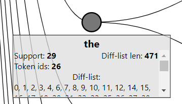
  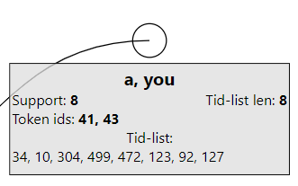
</div>

In the "Tokens Map" panel, once the `tokens_map.json` file is uploaded, you'll see the mapping of identifiers to all defined tokens.

In the "Data" panel, all the retrieved titles along with their assigned token identifiers are displayed. Both tables allow you to filter and sort their contents from the header.

"Tokens Map" and "Data" panels:

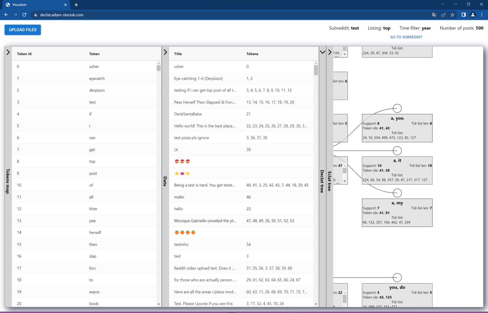

### Experiments
#### Definition of Research Data

The experiments will be conducted using the 500 most popular posts from the subreddits [funny](https://www.reddit.com/r/funny/) and [AMA](https://www.reddit.com/r/AMA/). The "funny" subreddit was chosen due to the wide variety of titles. The "AMA" subreddit was selected because it has a relatively large number of distinctive, recurring words in the titles.

Sample post titles from the "funny" subreddit:

- "My cab driver tonight was so excited to share with me that he’d made the cover of the calendar. I told him I’d help let the world see."
- "Gas station worker takes precautionary measures after customer refused to put out his cigarette."
- "The Denver Broncos have the entire town of ‘South Park’ in the stands for today’s NFL game."

Sample post titles from the "AMA" subreddit:

- "I'm going to do an AMA that will only have me, so myself, AMA!"
- "I turned 100 today and have built a LEGO set. AMA."
- "I’m a US citizen aboard the Diamond Princess quarantined off the coast of Yokohama, Japan. AMA!"

#### Plan of Experiments

For each dataset, dEclat and Eclat trees will be constructed for each integer value of minimum support in the range [4, 199]. Then, memory complexity will be compared based on four statistics regarding the transaction identifier sets in the tree nodes (tid-lists for Eclat and dif-lists for dEclat):

- The average size of the sets (the most significant measure for the research),
- The median size of the sets,
- The size of the smallest set,
- The size of the largest set.

The root of the tree, representing the empty set, will be excluded from the analyzed statistics, as it is stored only for visualization purposes and does not provide useful information for the actual results of the algorithms.

#### Conducting the Experiments
The experiments were conducted using a Jupyter notebook [experiments.ipynb](experiments.ipynb).

#### Visualization and Analysis of Results
The results were visualized using the [Matplotlib](https://matplotlib.org/) library. Each chart includes the dataset label and the exact date the data was retrieved, following the convention described in the [Data Retrieval and Preparation](#data-retrieval-and-preparation) section.

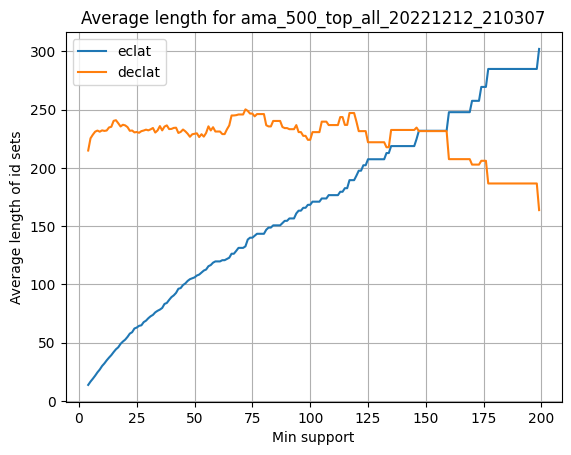

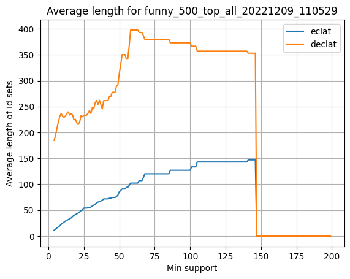

From the perspective of memory complexity analysis, these two charts are the most informative. Since the number of nodes in the trees is the same, the average size of the identifier lists shows the actual difference in memory usage.

On the chart for the "funny" dataset, a sudden drop to zero can be observed. This happens because the dataset, due to its high diversity, does not contain any itemsets with such high support.

As predicted, dEclat does not perform well with sparse datasets. However, for the "AMA" dataset, it can be seen that for supports greater than 150, it starts to perform more efficiently than its predecessor. This is because the dataset contains several very frequently occurring tokens ("ama", "I", "am"). For supports exceeding 150, only itemsets composed of these most popular tokens are processed, effectively "densifying" the dataset in the deeper layers of the tree.

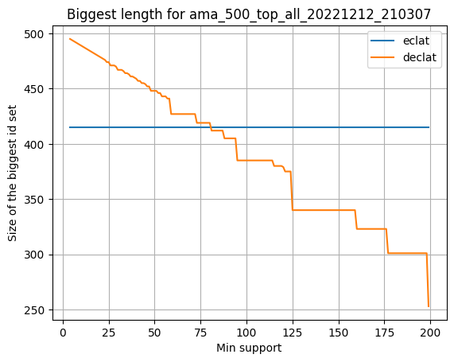

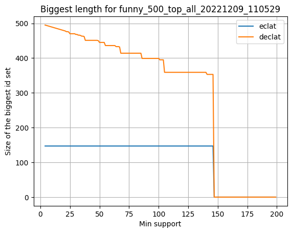

As predicted, the charts showing the size of the largest identifier lists for trees with a given support show that for the Eclat algorithm, this size remains constant, while for dEclat, it decreases as the minimum support increases. This happens because, in the Eclat algorithm, the longest lists are for the most frequent single-item itemsets at the first level of the tree. For dEclat, longer lists occur for itemsets that are much less frequent than their parents.

The other charts do not provide significant value for the analysis but are available for review in the project repository.

#### Experiment Summary and Possible Improvements
The dEclat algorithm was developed as an extension of the Eclat algorithm to reduce the memory required when determining tree nodes for datasets with relatively few individual tokens but a high density of their occurrences.

For the datasets defined in the project instructions (posts from social media forums), the token density is low, which means that the dEclat algorithm does not provide benefits.

It seems that the best solution for datasets with the described characteristics would be some kind of hybrid algorithm. This assumption is supported by the work of Tuan A. Trieu and Yoshitoshi Kunieda, ["An Improvement for dEclat Algorithm"](https://dl.acm.org/doi/pdf/10.1145/2184751.2184818).